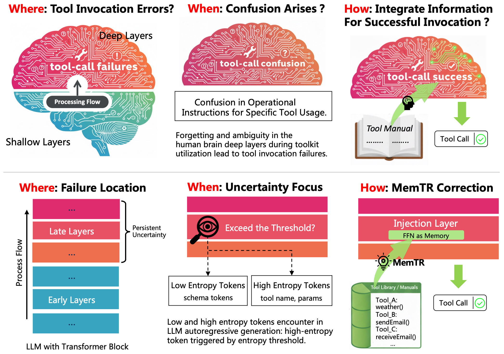
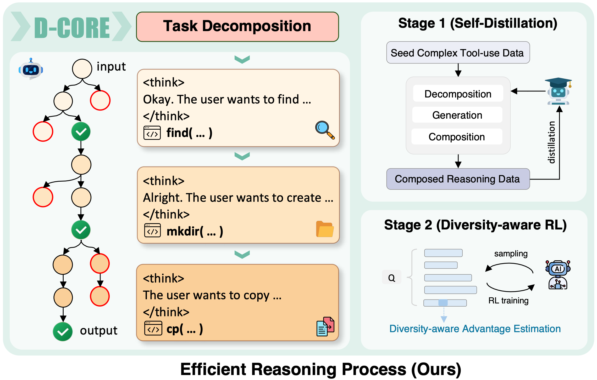
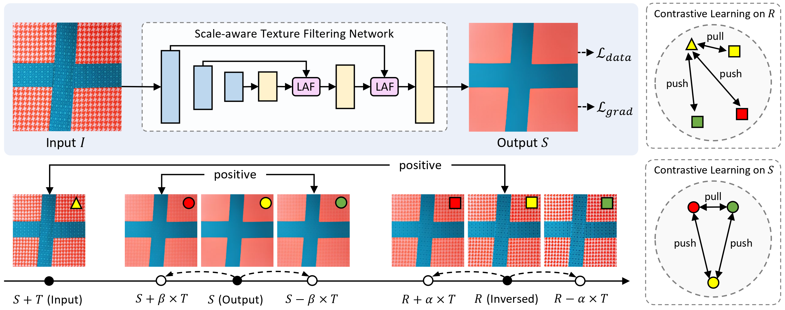
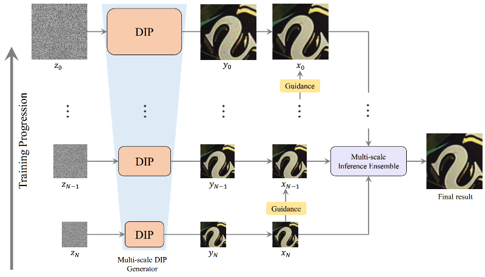

I am currently an algorithm engineer at [Alibaba Cloud Intelligence](https://www.alibabacloud.com/), specializing in reasoning and efficient inference of multimodal large language models (MLLMs). I received my Master's and Bachelor's degrees in [School of Computer Science and Engineering](https://cse.sysu.edu.cn/en), [Sun Yat-sen University (SYSU)](https://www.sysu.edu.cn/). My current research interests are LLM reasoning, Reinforcement Learning and Multi-Agent Systems.

🔥 News
------
- [2026.04] One paper accepted by ACL 2026 Findings
- [2026.01] Three papers submitted to ICML 2026
- [2025.08] One paper accepted by TOG (Proceedings of SIGGRAPH Asia 2025)
- [2024.06] I joined Alibaba Cloud Intellegence as an algorithm engineer
- [2023.05] I joined Alibaba Cloud Intellegence as an algorithm intern
- [2023.05] One paper accepted by International Journal of Computer Vision (IJCV)
- [2023.05] One paper accepted by TOG (Proceedings of SIGGRAPH 2023)
- [2023.03] One paper accepted by Computer Graphics Forum

📄 Publications
------

<!-- dark purple: 4C1C62 -->

  

    
  

  

    <strong >MemTR: Enhancing Tool-Calling Reliability via Uncertainty-Triggered FFN-Space Retracing</strong> 
    <em style="font-size: 0.80em;">Duan, H., Jiang, L., Zhang, M., Zhu, X., Bu, T., <strong>Jiang, H.</strong>, Wei, X., Hu, L.</em> 
    ACL 2026 Findings 
    <a href="https://rewindl.github.io/">Paper</a> | <a href="https://rewindl.github.io/">Code</a>
  

  

    
  

  

    <strong>D-CORE: Incentivizing Task Decomposition in Large Reasoning Models for Complex Tool Use</strong> 
    <em style="font-size: 0.80em;">Xu, B., Wu, S., <strong>Jiang, H.</strong>, Liu, K., Chen, X., Hu, L, Yang, B.</em> 
    Arxiv Preprint 
    <a href="https://rewindl.github.io/">Paper</a> | <a href="https://rewindl.github.io/">Code</a>
  

  

    
  

  

    <strong>Self-supervised Texture Filtering</strong> 
    <em style="font-size: 0.80em;"><strong>Jiang, H.</strong>, Zheng, R., Nie, Y., Xiao, C., Zheng, W., Zhang, Q.</em> 
    ACM Transactions on Graphics (Proceedings of SIGGRAPH Asia 2025) 
    <!-- (Proceedings of SIGGRAPH Asia 2025)   -->
    <a href="https://dl.acm.org/doi/10.1145/3744899">Paper</a> | <a href="https://rewindl.github.io/">Code</a>
  

  

    
  

  

    <strong>Learning to Remove Shadows from a Single Image</strong> 
    <em style="font-size: 0.80em;"><strong>Jiang, H.</strong>, Zhang, Q., Nie, Y., Zhu, L, Zheng, W.</em> 
    International Journal of Computer Vision 
    <a href="https://dl.acm.org/doi/abs/10.1007/s11263-023-01823-9">Paper</a> | <a href="https://github.com/RewindL/Self-ShadowGAN">Code</a>
  

  

    
  

  

    <strong>Pyramid Texture Filtering</strong> 
    <em style="font-size: 0.80em;">Zhang, Q., <strong># Jiang, H.</strong>, Nie, Y., Zheng, W. (# First Student Author)</em> 
    ACM Transactions on Graphics (Proceedings of SIGGRAPH 2023) 
    <!-- (Proceedings of SIGGRAPH 2023)  -->
    <a href="https://dl.acm.org/doi/10.1145/3592120">Paper</a> | <a href="https://rewindl.github.io/pyramid_texture_filtering/">Project</a> | <a href="https://github.com/RewindL/pyramid_texture_filtering">Code</a>
  

  

    
  

  

    <strong>Learning Multi-Scale Deep Image Prior for High-Quality Unsupervised Image Denoising</strong> 
    <em style="font-size: 0.80em;"><strong>Jiang, H.</strong>, Zhang, Q., Nie, Y., Zhu, L, Zheng, W.</em> 
    Computer Graphics Forum 
    <a href="https://onlinelibrary.wiley.com/doi/abs/10.1111/cgf.14680">Paper</a> | <a href="https://rewindl.github.io/">Code</a>
  

